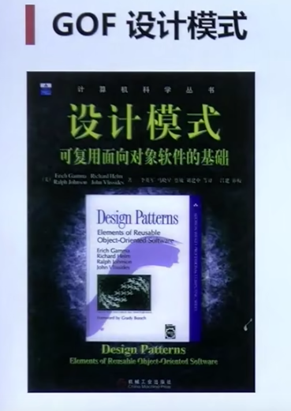
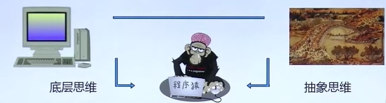

# 设计模式简介

## 1. 什么是设计模式

“每一个模式描述了一个在我们周围不断重复发生的问题，以及该问题的解决方案的核心。这样，你就能一次又一次地使用该方案而不必做重复劳动。

**推荐书籍：**

### 1.1 GOF设计模式

*   历史性著作《设计模式：可复用面向读写软件的基础》一本书描述了23种经典面向对象设计模式，创立了模式在软件设计中的地位。
*   由于《设计模式》一书确定了设计模式的地位，通常所说的设计模式隐含的表示”面向对象设计模式“。这并不意味着”设计模式“就等于”面向对象设计模式“。

---

## 2. 从面向对象谈起

程序员的作用在底层思维和抽象思维之间，要理解底层思维，然后把周围世界或你需要实现的事物抽象化，打通底层思维和抽象思维。

### 2.1 底层思维

向下，如何把握机器底层从微观理解对象构造

*   语言构造
*   编译转化
*   内存模型
*   运行时机制

### 2.2 抽象思维

向上，如何将我们的周围世界抽象为程序代码

*   面向对象
*   组件封装
*   设计模式
*   架构模式

---

## 3. 深入理解面向对象

**向下：**深入理解三大向下对象机制

*   封装，隐藏内部实现（内存布局，函数指针，虚函数表）
*   继承，复用现有代码（子类和父类对象模型，如何继承）
*   多态，改写对象行为（虚函数表在运行时期如何发生动态绑定的作用）

**向上：**深刻把握面向对象机制所带来的抽象意义，理解如何使用这些机制来表达现实世界，掌握什么是”好的面向对象设计“

### 4. 软件设计固有的复杂性

建筑商重来不会去想给一栋已经建好100层高的楼房再新修一个小地下室——这些做花费极大而注定失败。然而令人惊奇的是，软件系统的用户在要求作出类似改变时却不会考虑，而且他们认为这只是需要简单编程的事。

### 4.1 软件设计复杂性的根本原因

**变化**

*   客户需求的变化
*   技术平台的变化
*   开发团队的变化
*   市场环境的变化
*   ....

### 4.2 如何解决复杂性？

**分解：**

*   人们面对复杂性有一个常见的做法：即分而治之，将大问题解为多个小问题，将复杂问题分解为多个简单问题。

**抽象：**

*   更高层次来讲，人们处理复杂性有一个通用的技术，即抽象。由于不能掌握全部的复杂对象，我们选择忽视它的非本质的细节，而去处理泛化和理想化的对象模型。

## 4. 软件设计的目标

什么是好的软件设计？软件设计的金科玉律：**复用**