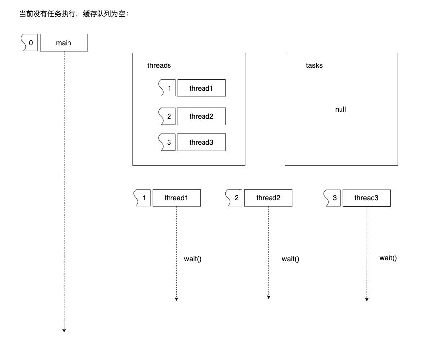
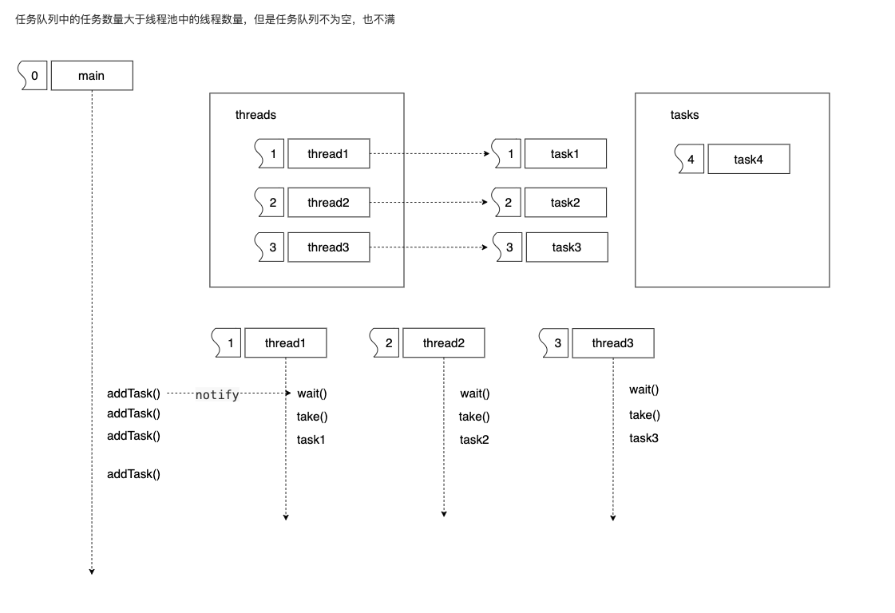
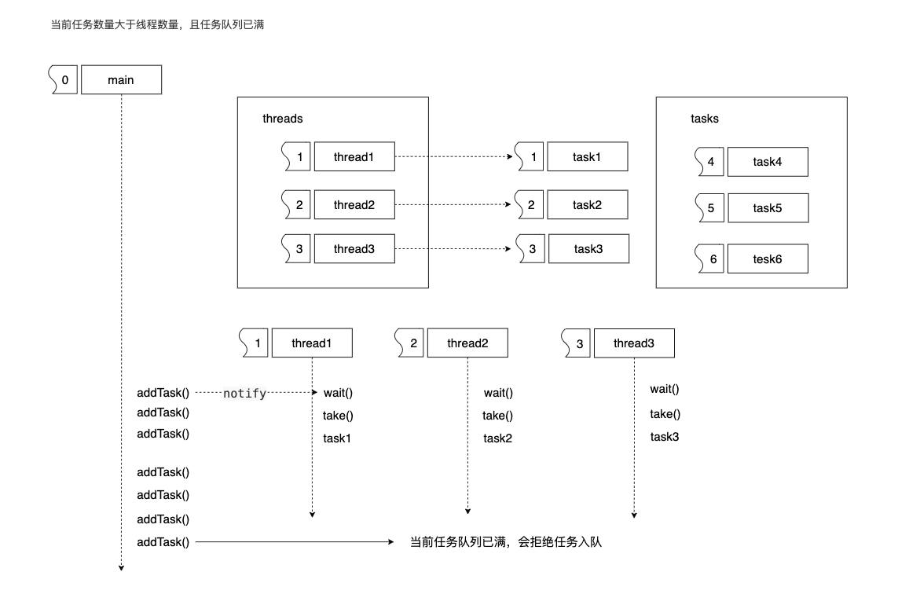
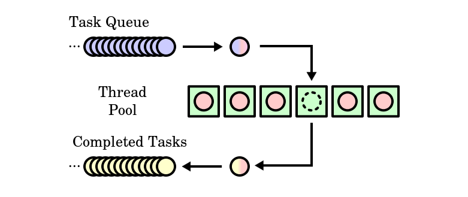

# 线程池的概念

### 一、基本概念

**线程池:** 当进行并行的任务作业操作时，线程的建立与销毁的开销是，阻碍性能进步的关键，因此线程池，由此产生。可提前开辟多个线程，无限制循环等待队列，进行计算和操作。帮助快速降低和减少性能损耗。

### 二、线程池的组成

1.   线程池管理器：初始化和创建线程，启动线程和停止线程，调配任务，管理线程池
2.   工作线程：线程池中等待并执行分配的任务（线程处理函数）
3.   任务接口：添加线程需要处理任务的接口，给工作线程提供任务处理
4.   任务队列：用于存放没有处理的任务，提供一种缓存机制，同时有调度功能，高优先级的任务放在队列前面

### 三、线程池工作的四种状态

#### 1. 阻塞状态

任务队列为空，所有线程都阻塞。

#### 2. 运行状态，任务队列为空

任务队列中的任务小于等于线程池中线程数量。

*   当任务队列中有任务到来(tasks)，则唤醒 notify 一个或多个线程。
*   一个或多个线程从任务队列中抢夺任务，然后处理任务。
*   上图情况是任务队列中的任务小于等于线程池中的线程数。

#### 3. 运行状态，任务队列不为空

任务队列中的任务数量大于线程池中的线程数量，但是任务队列不为空，也不满。

*   当任务队列中有任务到来(tasks)，则唤醒 notify 一个或多个线程。
*   一个或多个线程从任务队列中抢夺任务，然后处理任务。
*   上图情况是：任务队列中的任务数量大于线程池中的线程数量，但是任务队列不为空，也不满。

#### 4. 运行状态，主线程线程池拒接任务

当前任务数量大于线程数量，且任务队列已满。

*   当任务队列中有任务到来(tasks)，则唤醒 notify 一个或多个线程。
*   一个或多个线程从任务队列中抢夺任务，然后处理任务。
*   当前任务队列已满，如果还有任务需要入队，那么线程池会拒绝任务。
    *   可以对任务队列进行扩容
    *   可以创建新的工作线程来解决

### 三、线程池的实现c++11

#### 1.线程池实现流程图

#### 2. 任务队列

使用队列来存储工作任务，当有任务入队后，会唤醒一个或多个线程去抢夺任务队列中的任务，为保证每个工作线程拿到的是不同的任务，保证Queue线程的安全，会使用mutex（锁）来对任务队列上锁，每当一个工作线程需要从任务队列中拿取一个任务时，首先需要获取这个锁，保证每次操作任务队列是一个工作线程，保证任务队列中资源的安全性。

#### 3. 提交函数

线程池最重要的方法是想队列中添加任务。

*   接收任何参数
*   立即返回结果，避免主进程阻塞。

