# 图

**图：**图（Graph）是由顶点的有穷非空集合和顶点之间边的集合组成，通常表示为：**G(V,E)**，其中，**G** 表示一个图，**V** 是图 **G** 中顶点的集合，**E** 是图 **G** 中边的集合。

## 一、图的定义

### 1. 图的定义

图（Graph）是由顶点的有穷非空集合和顶点之间边的集合组成，通常表示为：**G(V,E)**，其中，**G** 表示一个图，**V** 是图 **G** 中顶点的集合，**E** 是图 **G** 中边的集合。

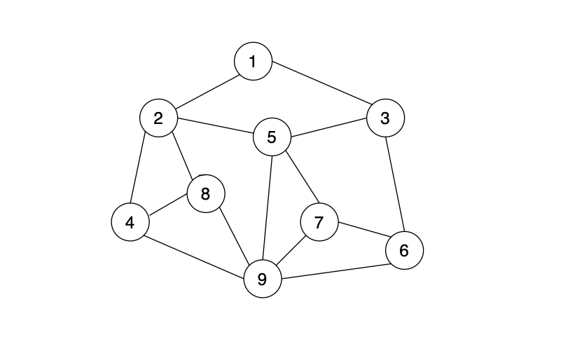

*   在图中数据元素叫做**顶点（Vertex）**。
*   在图中任意两个顶点之间都可以有关系，顶点之间的逻辑关系用边来表示，边集可以为空。

### 1.1 各种图的定义

#### 1.1.1 无向边

**无向边：**若顶点 $v_{i}$ 到 $v_{j}$ 之间的边没有方向，则称这条边为 **无向边（Edge）**，用**无序偶**对 **($v_{i}$, $v_{j}$)** 来表示。如果图中**任意两个顶点之间的边都是无向边**，则**该图成为无向图**。

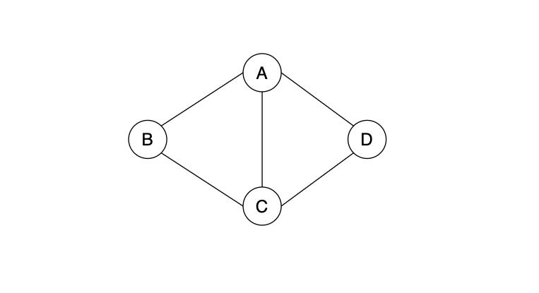

上图就是一个无向图，由于是无向边，连接顶点 **A** 与 **D** 的边，可以表示成无序对 **(A,D)** 或则是 **(D,A)**。对于图中的无向图 **G~1~** 来说，**G~1~ =  (V~1~, {E~1~})** ，其中顶点集合 **V~1~ = {A, B, C, D}**，边集合 **E~1~ = { (A, B), (B, C), (C, D), (D, A), (A, C) }**

#### 1.1.2 有向边

**有向边：**若从顶点 **$v$~i~** 到 **$v$~j~** 的边有方向，则称这条边为有向边，也称为**弧（Arc）**。用**有序偶**对 **<$v$~i~, $v$~j~>** 来表示，其中 **$v$~i~** 称为**弧尾（Tail）**，**$v$~j~** 称为**弧头（Head)**。如果图中**任意两个顶点之间的边都是有向边，则该图称为有向图（Directed graphs）**。

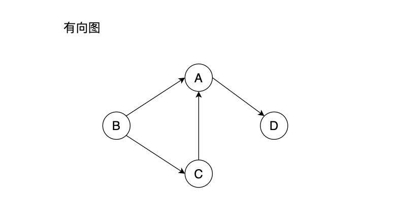

上图就是一个有向图，由于是有向图，连接顶点 **A** 到 **D** 的有向边就是 **弧**， **A 是弧尾**，**D是弧头**，**<A, D> 表示弧**，**注意**不能写成 **<D, A>**。对于图中的有向图 **G~2~** 来说，**$${G_{2} = (V_{2}, \{E_{2}\})}$$**，其中顶点集合 **$${V_{2} = \{A, B, C, D\}}$$** ，弧集合 **$${E_{2} = \{<A,D>,<B,A>,<C,A>,<B,C>\}}$$**。

#### 1.1.3 简单图

**简单图：**在图中，若不存在顶点到其自身的边，且同一条边不重复出现，则称这样的图为简单图。

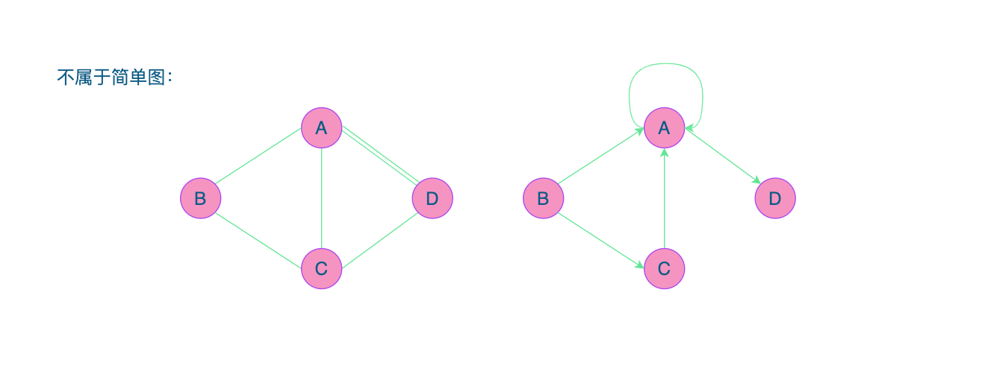

#### 1.1.4 无向完全图

**无向完全图：**在无向图中，如果任意两个顶点之间都存在边，则称该图为无向完全图。含有 **$n$** 个顶点的无向完全图有 **$$ \frac{n×(n-1)}{2} $$** 条边。对于具有 $n$ 个顶点和 $e$ 条边的无向图满足： **$$0≤e≤\frac{n×(n-1)}{2}$$**

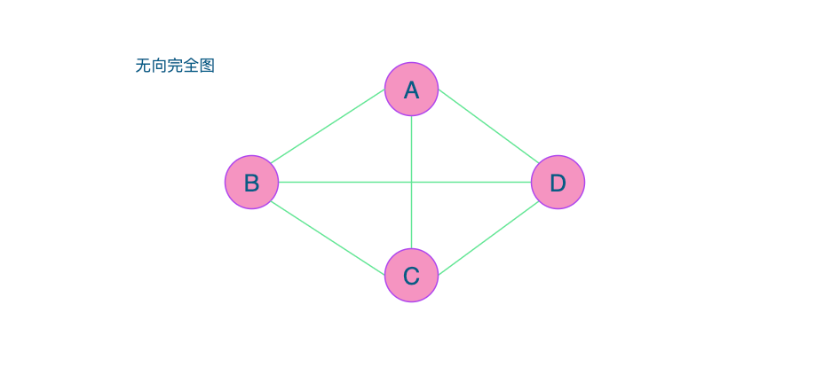

#### 1.1.5 有向完全图

**有向完全图：**在有向图中，如果任意两个顶点之间都存在方向互为相反的两条弧，则称为有向完全图。含有 $n$ 个顶点的有向完全图有 $${n×(n-1)}$$ 条边。对于具有 $n$ 个顶点和 $e$ 条边的有向图满足：$${0≤e≤n×(n-1)}$$。

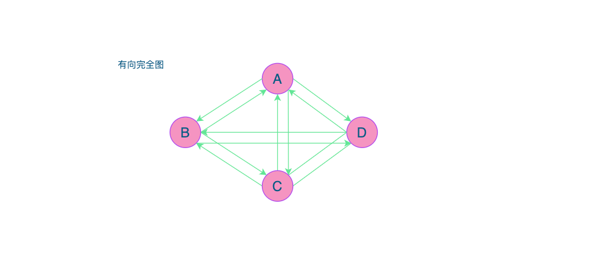

#### 1.1.6 稀疏和稠密图

**定义：**有很少条边或弧的图成为稀疏图，反之称为稠密图。这个稀疏图和稠密图是模糊的概念，都是相对而言的。

#### 1.1.7 网（Network）或带权图

**网：**有些图的边或弧带有与他相关的数字，这种**与图的边或弧相关的数叫做权（Weight）。**这种带权的图通常称为**网（Network）**。

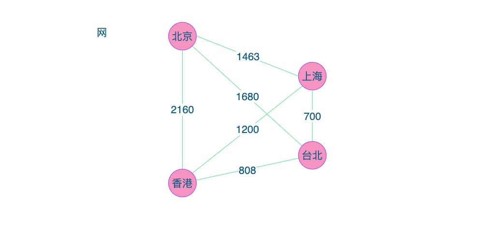

#### 1.1.8 子图

**子图：**假设有两个图 $${G=(V,\{E\})}$$ 和 $${G'=(V',\{E'\})}$$， 如果 $${V'⊆V}$$ 且 $${E'⊆E}$$，则称 $G'$ 为 $G$ 的 **子图（Subgraph）**。

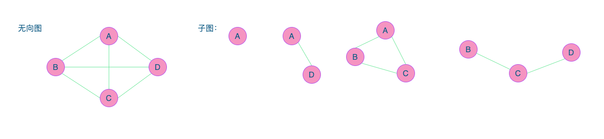 

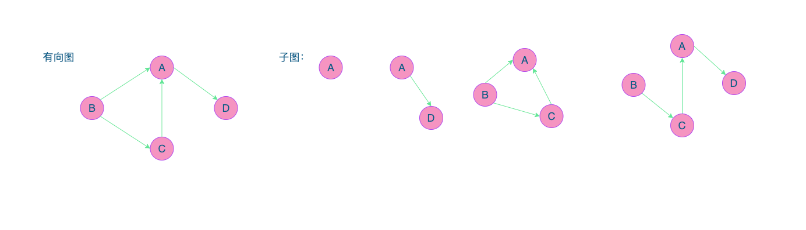

### 1.2 图的顶点与边间关系

#### 1.2.1 无向图

对于无向图 $${G=(V, \{E\})}$$，如果边 $${(v, v')}∈E$$ ，则称顶点 $v$ 和 $v'$ 互为邻接点**（Adjacent）**，即 $v$ 和 $v'$ 邻接。边 $${(v, v')}$$ 依附**（Incident）**于顶点 $v$ 和 $v'$，或者说 $${(v, v')}$$ 与顶点 $v$ 和 $v'$ 相关联。顶点 $v$ 的度**（Degree）**是和 $v$ 相关连的边的数目，记为 $${TD(v)}$$。


上图中顶点 $A$ 与 $B$ 互为邻接点，边 $${(A, B)}$$ 依附于顶点 $A$ 与 $B$ 上，顶点 $A$ 的度为 3。上图的边数为 5，各个顶点度的和=3+2+3+2=10，这有边数其实就是各个顶点度数和的一半，多出来的一半是重复计算两次的。简记为：$${e=\frac{1}{2}\sum_{i=1}^nTD(v_i)}$$。

#### 1.2.2 有向图

对于有向图 $${G=(V, \{E\})}$$，如果边 $${(v, v')}∈E$$ ，则称顶点 $v$ **邻接到**顶点 $v'$，顶点 $v'$ **邻接自**顶点 $v$。弧 $${(v, v')}$$ 和顶点 $v$，$v'$ 相关联。以顶点 $v$ 为头的弧的数目称为 $v$ 的**入度（InDegree）**，记为 $${ID(v)}$$；以 $v$ 为尾的弧的数目称为 $v$ 的**出度（OutDegree）**，记为 $${OD(v)}$$，顶点 $v$ 的度为 $${TD(v)=ID(v)+OD(v)}$$。

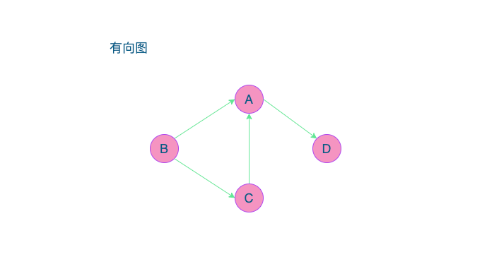

上图中 $A$ 的入度为2（从 $B$ 到 $A$ 的弧，和从 $C$ 到 $A$ 的弧），出度为 1（从 $A$ 到 $D$ 的弧），所以顶点 $A$ 的度=1+2=3。此有向图的弧为4条，而各个顶点的出度和=1+2+1+0=4，各顶点的入度和=2+0+1+1=4。所以得到 $${e=\sum_{i=1}^nID(v_i)=\sum_{i=1}^nOD(v_i)}$$。

#### 1.2.3 路径和环

**路径：**

**路径的长度：**路径的长度是路径上的边或弧的数目。

**无向图** $${G=(V, \{E\})}$$ 中顶点 $v$ 到顶点 $v'$ 的**路径（Path）**是一个顶点序列 $${(v=v_{i,0}, v_{i,1},...,v_{i,m}=v')}$$ 其中 $${(v_{i,j-1}, v_{i,j})∈E,1≤j≤m}$$。

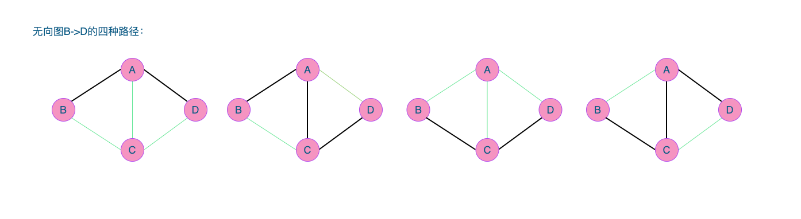

**有向图** $${G=(V, \{E\})}$$，则路径也是有向的，顶点序列应满足 $${<v_{i,j-1},v_{i,j}>∈E,1≤j≤m}$$。

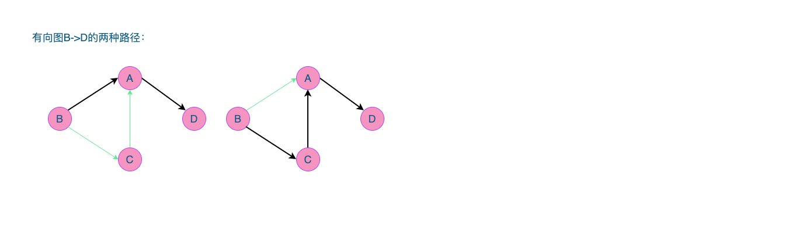

**环：**

第一个顶点到最后一个顶点相同的路径称为**回路或环（Cycle）**。序列中顶点不重复出现的路径称为简单路径。除第一个顶点和最后一个顶点之外，其余顶点不重复出现的回路，称为**简单回路或简单环**。

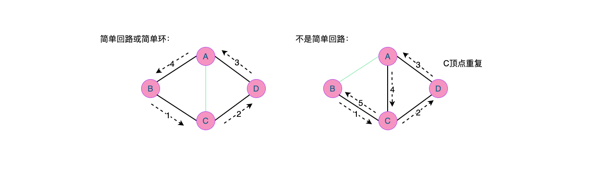

### 1.3 连通图相关术语

#### 1.3.1 连通图

在无向图 $G$ 中，如果从顶点 $v$ 到顶点 $v'$ 有路径，则称为 $v$ 和 $v'$ 是连通的。如果对于图中任意两个顶点 $${v_i、v_j∈V}$$，$v_i$ 和 $v_j$ 都是连通的，则称 $G$ 是**连通图（Connected Graph）**。

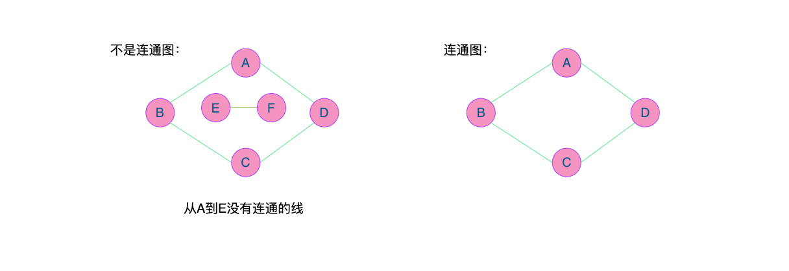

#### 1.3.2 连通分量

**无向图中的极大连通子图称为连通分量**。注意连通分量的概念，**强调：**

*   要是子图
*   子图要是连通的
*   连通子图含有极大顶点数
*   具有极大顶点数的连通子图包含依附于这些顶点的所有边

上图中，$${G=(V,\{E\}),V=\{E,F\}, E=\{(E,F)\}}$$ 就是第一张图的连通分量，第二张图也是第一张图的连通分量。

#### 1.3.3 强连通图和强连通分量

在有向图 $G$ 中，如果对于如果每一对 $${v_i、v_j∈V、v_i\not=v_j}$$，从 $v_i$ 到 $v_j$ 和从 $v_j$ 到 $v_i$ 都存在路径，则称 $G$ 是强连通图。有向图中的极大强连通子图称做有向图的强连通分量。

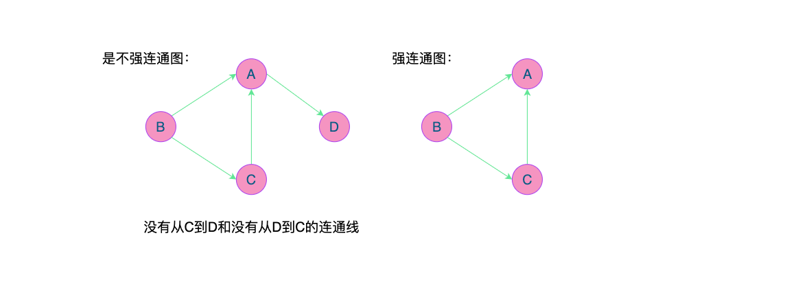

第一张图就不是强连通图，第二张图为强连通图，而且第二张图是第一张的强连通分量。

#### 1.3.4 连通图的生成树

**定义：**所谓的一个连通图的生成树是一个极小的连通图，它包含有图中全部的 $n$ 个顶点，但只有足以构成一棵树的 $n-1$ 条边。

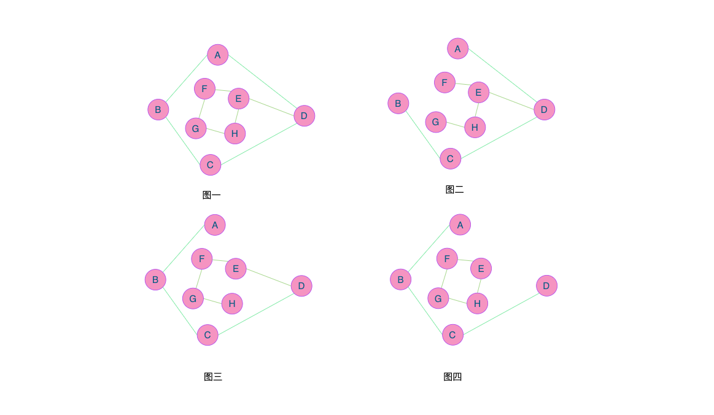

上图中：图一就是一个普通图，但显然它不是一棵生成树，当去掉两条构成环的边后，比如图二图三，就就满足 $n$ 个顶点 $n-1$ 条边且连通的定义，它们就是一棵生成树。如果一个图有 $n$ 个顶点和小于 $n-1$ 条边，则是非连通图，如果它多于 $n-1$ 条边，必定构成一个环，因为这条边使得依附于它的两个顶点之间有了第二条路径。不过有 $n-1$ 条边并不一定是生成树，比如图4。

#### 1.3.5 有向树和生成森林

**有向树：**如果一个有向图恰好有一个顶点的入度为0，其余顶点的入度均为1，则是一颗有向树。

**生成森林：**一个有向图的生成森林由若干有向树组成，含有图中全部顶点，但只有足以构成若干棵树不相交的有向树的弧。

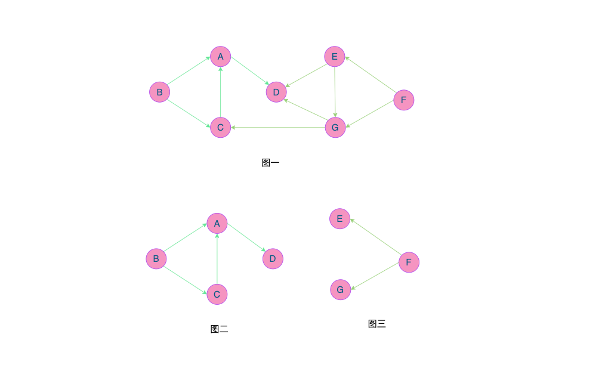s

上图中，图一是一棵有向图。去掉一些弧后，它就可以分解为两棵有向树，如图二和图三，这两棵树就是图一有向图的生成森林。

### 1.4 图的定义与术语总结

​	**图**按照有无方向分为无向图和有向图。无向图有**顶点**和**边**构成，有向图有**顶点**和**弧**构成。弧有**弧尾**和**弧头**之分。

​	图按照边或弧的多少分**稀疏图**和**稠密图**。如果任意两个顶点之间都存在边叫做**完全图**，有向的叫做**有向完全图**。若无重复的边或顶点到自身的边则叫做**简单图**。

​	图中顶点之间有**邻接点**、**依附**的概念。无向图顶点的边数叫做**度**，有向图顶点分为**入度**和**出度**。

​	图上的边或弧上带**权**则称为**网**。

​	图中顶点见存在**路径**，两个顶点存在路径则说明是**连通**的，如果路径最终回到起始点则称为**环**，当中不重复叫**简单路径**。若任意两顶点都是连通的，则图就是**连通图**，有向则称**强连通图**。图中有子图，若子图极大连通则就是**连通分量**，有向的则称**强连通分量**。

​	无向图中连通且 $n$ 个顶点 $n-1$ 条边叫做**生成树**。有向图中一顶点入度为0其余顶点入度为1的叫**有向树**，一个有向图有若干棵有向树构成**生成森林**。

## 二、图的抽象数据类型

### 1. 图的基本操作

```
ADT 图（Graph）
Data
	顶点的有穷非空集合和边的集合
Operation: 操作
	CreateGraph(*G, V, VR): 按照顶点集V和边弧集VR的定义构建图G
	DestroyGraph(*G): 图G存在则销毁
	LocateVex(G, u): 若图G存在顶点u，则返回图中的位置
	GetVex(G, v): 返回图G中顶点v的值
	PutVex(G, v, value): 将图G中顶点v赋值value
	FirstAdjVex(G, *v): 返回顶点v的一个邻接顶点，若顶点在G中无邻接顶点返回空
	NextAdjVex(G, v, *w): 返回顶点v相对顶点w的下一个邻接顶点，若w是v的最后一个邻接点则返回“空”
	InsertVex(*G, v): 在图G中增添新顶点v
	DeleteVex(*G, v): 删除图G中顶点v及其相关的弧
	InsertArc(*G, v, w): 在图G中增添弧<v, w>，若G是无向图，还需要增添对称弧<w, v>
	DeleteArc(*G, v, w): 在图G中删除弧<v, w>，若G是无向图，还需要删除对称弧<w, v>
	DFSTraverse(G): 对图G进行深度优先遍历，在遍历过程中对每个顶点调用
	HFSTraverse(G): 对图G进行广度优先遍历，在遍历过程中对每个顶点调用
endADT
```


