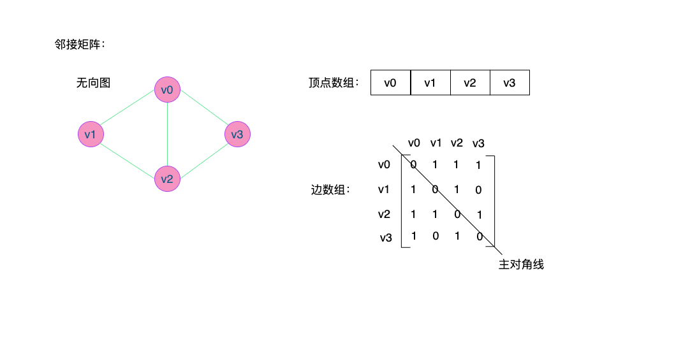
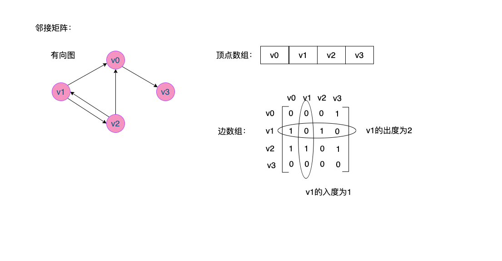
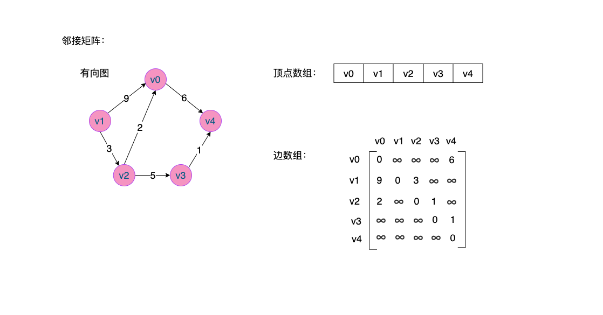
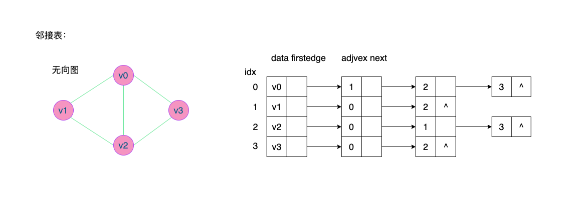
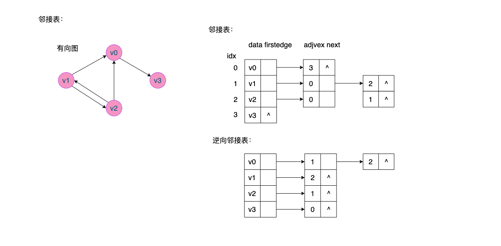
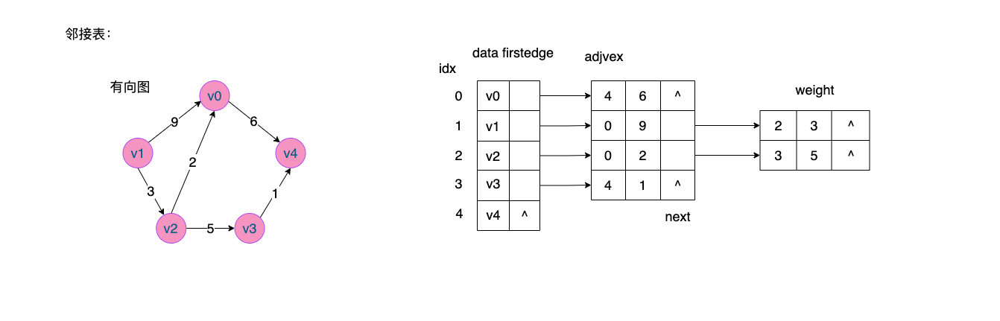

# 图的实现

## 一、图的存储结构

### 1. 邻接矩阵（Adjacency Matrix）

**定义：**图的邻接矩阵**（Adjacency Matrix）**存储方式是用两个数组来表示图。一个一维数组存储图中顶点信息，一个二维数组**（称为邻接矩阵）**存储图中的边或弧的信息。

#### 1.1 无权图

设图 $G$ 有 $n$ 个顶点，则邻接矩阵是一个 $n*n$ 的方阵，定义为：
$$
arc[i][j] = 
\left\{
\begin{array}{l}
1, 若(v_i, v_j)∈E或<v_i, v_j>∈E\\
0, 表示v_i 与 v_j无关系
\end{array}
\right.
$$
下列是一个无向图的示例：



有了上图这个矩阵，就可以很容易知道图中的信息：

*   判断两个顶点之间是否有边无边就很容易，为1就是有边，为0就是无边，例如：${<v_1, v_2> = 1}$ 表示两个顶点之间有边
*   如果需要知道某个顶点的度，其实就是这个顶点 $v_i$ 在邻接矩阵中低 $i$ 行（或第 $i$ 列）的元素之和，例如顶点 $v_1$ 的度就是 $1+0+1+0 = 2$
*   求顶点 $v_i$ 的所有邻接点就是将矩阵中第 $i$ 行元素扫描一遍，`arc[i][j]` 为 $1$ 就是邻接点。

下列是一个有向图示例：



*   有向图分为入度和出度，要判断入度就是看列数相加，要判断出度就是看行数相加，例如 $v_i$ 的出度$=1+0+1+0=2$ ，入度$=0+0+1+0$。

#### 1.2 有权图（网）

设图 $G$ 是网图，有 $n$ 个顶点，则邻接矩阵是一个 $n×n$ 的方阵，定义为：
$$
arc[i][j] = 
\left\{
\begin{array}{l}
W_{ij}, 若(v_i,v_j)∈E或<v_i,v_j>∈E\\
0, 若i=j\\
\infin，反之
\end{array}
\right.
$$

*   $W_{ij}$ 表示 ${(v_i, v_j)}$ 或 ${<v_i, v_j>}$ 上的权值。

*   $0$ 表示 $i=j$
*   ${\infin}$ 表示不可到达



#### 1.3 邻接矩阵的实现

**邻接矩阵的结构：**

```c
typedef char    VertexType;         // 顶点类型
typedef int     EdgeType;           // 边上的权值类型

#define         MAXVEX      100         // 最大顶点数
#define         INFINITY    INT_MAX     // 无穷大值

typedef struct AdjMat {
    VertexType  vexs[MAXVEX+5];             // 顶点表
    EdgeType    arc[MAXVEX+5][MAXVEX+5];    // 邻接表
    int numVertexes, numEdges;              // 图中的顶点个数和边数
    int graphType;                          // 图的类型，有向还是无向图
}AdjMat;
```

**邻接矩阵的头文件：**

```c
#ifndef __ADJACENCY_MAXTRIX_H__
#define __ADJACENCY_MAXTRIX_H__
#include <limits.h>

typedef char    VertexType;         // 顶点类型
typedef int     EdgeType;           // 边上的权值类型
#define         MAXVEX      100         // 最大顶点数
#define         INFINITY    INT_MAX     // 无穷大值

/* 图的类型定义 */
#define         GRAPH_TYPE_EDGE         0x01    // 无向图
#define         GRAPH_TYPE_DIRECTED     0x02    // 有向图
#define         GRAPH_TYPE_WEDGE        0x04    // 无向有权图
#define         GRAPH_TYPE_WDIRECTED    0x08    // 有向有权图

typedef struct AdjMat {
    VertexType  vexs[MAXVEX+5];             // 顶点表
    EdgeType    arc[MAXVEX+5][MAXVEX+5];    // 邻接表
    int numVertexes, numEdges;              // 图中的顶点个数和边数
    int graphType;                          // 图的类型，有向还是无向图
}AdjMat;

// 创建网图的邻接矩阵表示
void createAdjMat(AdjMat *g, int type);
// 打印图
void printAdjMat(AdjMat *g);
#endif // __ADJACENCY_MAXTRIX_H__
```

**邻接矩阵的源文件**

```c
#include <stdio.h>
#include "AdjMatrix.h"

// 创建图的邻接矩阵表示
void createAdjMat(AdjMat *g, int type) {
    g->graphType = type;    // 初始化图的类型，有向图还是无向图，是否有权

    // 初始化顶点数组
    int i, j, k;
    EdgeType w;     // 权重
    printf("请输入顶点个数和边的条数: \n");
    scanf("%d %d", &g->numVertexes, &g->numEdges);
    printf("请输入顶点信息: \n");
    for (i = 0; i < g->numVertexes; i++) {
        // 解决 scanf 被跳过
        getc(stdin);
        scanf("%c", &g->vexs[i]);
    }

    // 初始化邻接矩阵
    // 显判断是什么图，是否为网图
    int value = 0;
    if (g->graphType & GRAPH_TYPE_WDIRECTED || g->graphType & GRAPH_TYPE_WEDGE) {
        // 表示初始化为无穷大
        value = INFINITY;
    }
    // 开始初始化
    for (i = 0; i < g->numVertexes; i++) 
        for (j = 0; j < g->numVertexes; j++) 
            if (i == j) 
                g->arc[i][j] = 0;
            else 
                g->arc[i][j] = value;
    
    // 创建图
    for (k = 0; k < g->numEdges; k++) {
        if (g->graphType & GRAPH_TYPE_WDIRECTED || g->graphType & GRAPH_TYPE_WEDGE) {
            // 如果是网图需要有权重
            printf("请输入<vi,vj>/(vi,vj)的下标和权(1 2 10): \n");
            getc(stdin);
            scanf("%d %d %d", &i, &j, &w);
            if (g->graphType & GRAPH_TYPE_WDIRECTED) {
                // 表示是有向网图
                g->arc[i][j] = w;
            } else {
                // 表示为无向网图
                g->arc[i][j] = w;
                g->arc[j][i] = w;
            }
        } else {
            // 否则就是不带权的图
            printf("请输入<vi,vj>/(vi,vj)的下标(1 2): \n");
            getc(stdin);
            scanf("%d %d", &i, &j);
            if (g->graphType & GRAPH_TYPE_EDGE) {
                // 无向图
                g->arc[i][j] = 1;
                g->arc[j][i] = 1;
            } else {
                // 有向图
                g->arc[i][j] = 1;
            }
        }
    }
}

// 打印图
void printAdjMat(AdjMat *g) {
    for (int i = 0; i < g->numVertexes; i++) {
        for (int j = 0; j < g->numVertexes; j++) {
            j == 0 || printf(" ");
            if (g->arc[i][j] == INFINITY)
                printf("%s", "∞");
            else 
                printf("%d", g->arc[i][j]);
        }
        printf("\n");
    }
}
```

### 2. 邻接表（Adjacency List）

邻接矩阵对于边数较少的图，这种结构在对存储空间的浪费很大。

**邻接表的定义：**将结点存入数组中，在数组下托一条链表，链表用来存储邻接点，把这种**数组与链表结合的存储方式称为邻接表（Adjacency List）**。

邻接表的处理方式：

*   图中顶点有一个一维数组存储，当然顶点也可以使用单链表来存储，不过数组可以比较容易地读取顶点信息，更加方便。另外，对于顶点数组中，没个数据元素还需要存储指向第一个邻接点的指针，以便于查找该顶点的边信息。
*   图中每个顶点 $v_i$ 的所有邻接电构成一个线性表，由于邻接点的个数不定，所以用单链表存储，无向图称为顶点 $v_i$ 的边表，有向图则称为顶点 $v_i$ 作为弧的出边表。

#### 2.1 无权图

下列是**无向图**示例



*   顶点表的各个结点由 `data` 和 `firstedge` 两个域表示，`data` 表示数据域，存储顶点信息，`firstedge` 是指针域，指向边表的第一个结点。
*   边表结点由 `adjvex` 和 `next` 两个域组成，`adjvex` 是邻接点域，存储某顶点的邻接点在顶点表中的下标，`next` 则存储指向边表下一个结点的指针。

下列是**有向图**示例

因为有向图是有方向的，以顶点为**弧尾**来存储边表的，这样很容易就可以得到每个顶点的出度。但也有时为了便于确定顶点的入度以及顶点为弧头的弧，可以建立**一个有向图的逆邻接表**，即对每个顶点 $v_i$ 都建立一个链接为 $v_i$ 为弧头的表示。



*   逆向邻接表表示的是顶点的入度。

#### 2.2 有权图（网）

对于带权值的网图，可以在表结点定义中在添加一个 `weight` 的数据域，存储权值信息。



*   如果是有向网图，则可以添加一个逆邻接表来表示顶点的入度。

#### 2.3 邻接表的实现

##### 2.3.1 无向图的邻接表实现

**邻表的结构定义：**

```c
#define MAXVERTEX   100

typedef char VertexType;
typedef int EdgeType;

typedef struct EdgeNode {
    int idxVertex;      // 顶点的索引
    EdgeType weight;    // 权重
    struct EdgeNode *pnext; // 指向下一个边表指针
}EdgeNode;  // 边表的结点结构

typedef struct VertexNode {
    VertexType data;
    struct EdgeNode *firstEdge;
}VertexNode, AdjList[MAXVERTEX+5];    // 顶点集合

typedef struct {
    AdjList adjList;
    int numEdge, numVertex; // 边数和顶点数
}GraphAdjList;  // 图
```

**头文件：**

```c
#ifndef __ADJACENCY_LIST_H__
#define __ADJACENCY_LIST_H__

/**
 * @brief 
 * 邻接表的实现，该实现是无向有权图
 */

#define MAXVERTEX   100

typedef char VertexType;
typedef int EdgeType;

typedef struct EdgeNode {
    int idxVertex;      // 顶点的索引
    EdgeType weight;    // 权重
    struct EdgeNode *pnext; // 指向下一个边表指针
}EdgeNode;  // 边表的结点结构

typedef struct VertexNode {
    VertexType data;
    struct EdgeNode *firstEdge;
}VertexNode, AdjList[MAXVERTEX+5];    // 顶点集合

typedef struct {
    AdjList adjList;
    int numEdge, numVertex; // 边数和顶点数
}GraphAdjList;  // 图

// 创建图
void CreateAdjListGraph(GraphAdjList *g);

// 添加边
void AddEdge(GraphAdjList *g, int i, int j, int w);

// 打印邻接表
void PrintGraphAdjList(GraphAdjList *g);

// 销毁邻接表
void DestroyGraphAdjList(GraphAdjList *g);

#endif // __ADJACENCY_LIST_H__
```

**源文件：**

```c
#include <stdio.h>
#include <malloc.h>
#include "AdjList.h"

// 创建图
void CreateAdjListGraph(GraphAdjList *g) {
    // 需要使用的变量
    int i, j, w, k;
    // 输入顶点个数和边数
    printf("请输入顶点个数和边个条数(1 2): \n");
    scanf("%d %d", &g->numVertex, &g->numEdge);
    getc(stdin); // 去除scanf最后一个没有读取的 \n

    // 初始化顶点
    printf("请输入顶点信息: \n");
    for (i = 0; i < g->numVertex; i++) {
        // 初始化顶点值
        scanf("%c", &g->adjList[i].data);
        // 初始化顶点的第一个边表为NULL
        g->adjList[i].firstEdge = NULL;
        getc(stdin);    // 吃掉 scanf 输入时的回车键或其他空格键
    }

    // 创建无向有权图
    for (k = 0; k < g->numEdge; k++) {
        printf("请输入(vi,vj)的下标和权(1 2 10): \n");
        scanf("%d %d %d", &i, &j, &w);
        getc(stdin);

        // 添加到顶点对应的边表上，因为是无向图，所以两边顶点都需要添加
        // 添加顶点i的邻接点
        AddEdge(g, i, j, w);
        // 添加顶点j的邻接点
        AddEdge(g, j, i, w);
    }
}

// 添加边
void AddEdge(GraphAdjList *g, int i, int j, int w) {
    EdgeNode *tmp = (EdgeNode *)malloc(sizeof(EdgeNode));
    tmp->idxVertex = j;
    tmp->weight = w;
    tmp->pnext = g->adjList[i].firstEdge;
    g->adjList[i].firstEdge = tmp;
}

// 打印邻接表
void PrintGraphAdjList(GraphAdjList *g) {
    for (int i = 0; i < g->numVertex; i++) {
        EdgeNode *move = g->adjList[i].firstEdge;
        printf("%c的邻接点: ", g->adjList[i].data);
        while (move) {
            printf("%d ", move->idxVertex);
            move = move->pnext;
        }
        printf("\n");
    }
}

// 销毁邻接表
void DestroyGraphAdjList(GraphAdjList *g) {
    for (int i = 0; i < g->numVertex; i++) {
        EdgeNode *move = g->adjList[i].firstEdge;
        EdgeNode *tmp = NULL;
        while (move){ 
            tmp = move;
            move = move->pnext;
            free(tmp);
        }
    }
}
```

### 3. 十字链表

**定义：** 将邻接表和逆邻接表结合起来，这种存储方式就是**十字链表（Orthogonal List）**。十字链表是对有向图的优化。

重新定义顶点表结构体：


*   `firstin` 表示入边表头指针，指向该顶点的入边表中第一个结点
*   `firstout` 表示出边表头指针，指向该顶点的出边表中的第一个结点

重新定义的边表结点结构：


*   `tailvex` 是指弧起点在顶点表的下标
*   `headvex` 是指弧终点在顶点表中的下标
*   `headlink` 是指入边指针域，指向终点相同的下一条边（入边）
*   `taillink` 是指出边指针域，指向起点相同的下一条边（出边）

#### 3.1 有向图

下列是一个有向图的十字链表示例：


#### 3.2 十字链表的实现

**十字链表结构体：**

```c
#define VERTEXMAX   100

typedef char    VertexType;         // 顶点类型
typedef int     EdgeType;           // 边上的权值类型

// 边表结构
typedef struct EdgeNode{
    VertexType tailvex, headvex;   // 弧头弧尾信息
    struct EdgeNode *taillist, *headlist;    // 出边和入边指针
}EdgeNode;

// 顶点表结构体
typedef struct VertexNode{
    /* data */
    VertexType data;
    struct EdgeNode *firstin, *firstout;
}VertexNode, OrthList[VERTEXMAX+5];

typedef struct GraphOrthogonal{
    OrthList orthList;
    int numEdge, numVertex;
}GraphOrth;
```

**头文件：**

```c
#ifndef __ORTHOGONA_LIST_H__
#define __ORTHOGONA_LIST_H__

/**
 * @brief 
 * 十字链表的实现
 */

#define VERTEXMAX   100

typedef char    VertexType;         // 顶点类型
typedef int     EdgeType;           // 边上的权值类型

// 边表结构
typedef struct EdgeNode{
    VertexType tailvex, headvex;   // 弧头弧尾信息
    struct EdgeNode *taillist, *headlist;    // 出边和入边指针
}EdgeNode;

// 顶点表结构体
typedef struct VertexNode{
    /* data */
    VertexType data;
    struct EdgeNode *firstin, *firstout;
}VertexNode, OrthList[VERTEXMAX+5];

// 图
typedef struct GraphOrthogonal{
    OrthList orthList;
    int numEdge, numVertex;
}GraphOrth;

// 创建十字链表
void CreateOrthList(GraphOrth *g);
// 打印图
void PrintOrthList(GraphOrth *g);
// 销毁图
void DestroyRothList(GraphOrth *g);

#endif // __ORTHOGONA_LIST_H__
```

**源文件：**

```c
#include <stdio.h>
#include <stdlib.h>
#include "OrthList.h"

// 创建十字链表
void CreateOrthList(GraphOrth *g) {
    int i, j, k;

    printf("请输入当前的顶点个数及边数: \n");
    scanf("%d %d", &g->numVertex, &g->numEdge);
    getc(stdin);

    // 初始化顶点
    printf("请输入顶点信息: \n");
    for (i = 0; i < g->numVertex; i++) {
        scanf("%c", &g->orthList[i].data);
        getc(stdin);
        g->orthList[i].firstin = NULL;
        g->orthList[i].firstout = NULL;
    }

    // 初始化边
    int edges[VERTEXMAX][2];
    for (k = 0; k < g->numEdge; k++) {
        printf("请输入边<vi, vj>的下标: \n");
        scanf("%d %d", &i, &j);

        // 初始化边
        EdgeNode *tmp = (EdgeNode *)malloc(sizeof(EdgeNode));
        tmp->headvex = g->orthList[i].data;
        tmp->tailvex = g->orthList[j].data;

        // 头插法插入新的p结点
        // 确定入边, i的入边就是j的出边
        tmp->headlist = g->orthList[j].firstin;
        // 确定出边, i的入边
        tmp->taillist = g->orthList[i].firstout;
        // 添加节点
        g->orthList[j].firstin = g->orthList[i].firstout = tmp;
    }
}

void PrintOrthList(GraphOrth *g) {
    // 入度
    for (int i = 0; i < g->numVertex; i++) {
        EdgeNode *move = g->orthList[i].firstout;
        printf("vertex %c of out edge: ", g->orthList[i].data);
        while (move) {
            printf("%c ", move->tailvex);
            move = move->taillist;
        }
        printf("\n");
    }

    // 出度
    for (int i = 0; i < g->numVertex; i++) {
        EdgeNode *move = g->orthList[i].firstin;
        printf("vertex %c of in edge: ", g->orthList[i].data);
        while (move) {
            printf("%c ", move->headvex);
            move = move->headlist;
        }
        printf("\n");
    }
}

void DestroyRothList(GraphOrth *g) {
    for (int i = 0; i < g->numVertex; i++) {
        EdgeNode *move, *tmp;
        move = g->orthList[i].firstout;
        while (move) {
            tmp = move;
            move = move->taillist;
            free(tmp);
        }
    }
}
```

### 4. 邻接多重表

**定义：**邻接多重表（Adjacent Multi List）是[无向图](https://baike.baidu.com/item/无向图/1680427)的一种存储方式。邻接多重表是邻接表的改进，它把边的两个顶点存放在边表结点中，所有依附于同一个顶点的边串联在同一链表中，由于每条边依附于两个顶点，则每个边表结点同时链接在两个链表中。邻接多重表是对无向图的一种优化。

顶点结构：


*   `data` 数据域用来存储顶点信息
*   `firstedge` 指针域用来指向当前顶点的第一条边的链表

重新定义边表结构：


*   `ivex` 和 `jvex`  是与某条边依附的两个顶点在顶点表中的下标。
*   `ilink` 指向依附顶点 `ivex` 的下一条边
*   `jlink` 指向依附顶点 `jvex` 的下一条边

#### 4.1 无向图

下列是一个无向图的邻接多重表示例：


